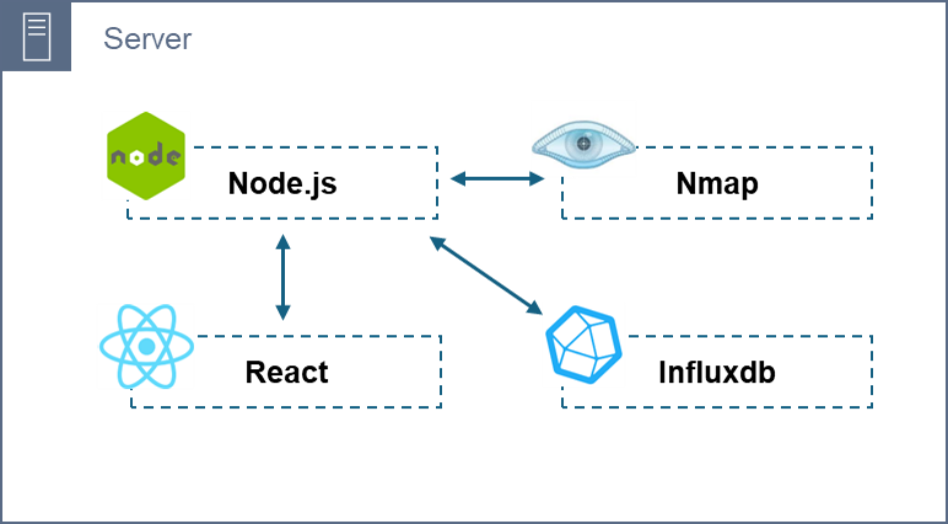

# IoT Monitoring System

IoT 기기의 네트워크 및 하드웨어 모니터링 시스템

# 개발 배경

오늘날 IoT 시장의 발달로 인해 스마트 홈을 이용하는 가구 또한 2018년을 기준으로 170억 개를 초과하며 활성화된 장치 중 IoT 관련 기기는 70억 개의 도달하며 전 세계적으로 사용률이 증가하고 있다. 이에 따른 사이버 범죄 또한 같이 증가하고 범죄 대응 기술과 범죄를 예방하기 위해 IoT 데이터를 시각화 하려는 모니터링 시스템이 개발되고 있는 추세이지만, 네트워크 구조를 시각화하여 모니터링 하는 방식은 부족한 실정이다. 따라서 기존 스마트 홈 IoT 보안 모니터링 시스템과 차별화한 노드와 간선을 활용하여 IoT 기기의 네트워크 간 관계를 실시간으로 파악하고 뿐만 아니라 공격 탐지에 따른 대응 방안과 보안 취약점 진단 기능을 제공하는 시스템을 구현하고자 한다

## 프로젝트 기간

24.03.27 ~ 24.06.12

## 개발 환경

- 언어: JS, Python
- 라이브러리: NumPy, pandas, TensorFlow, scikit-learn, Scapy, D3.js
- 프레임워크: Node.js, React
- 오픈소스: Grafana, Prometheus, Node_Exporter, InfluxDB, Nmap

## 시스템 구성도

### - 전체 구성도

### - 패킷 데이터 수집 및 시각화

### - 시스템 메트릭 시각화

### - DR-DoS 등 공격 탐지 및 시각화

### - 내부 네트워크 연결 기기 탐지 및 시각화

## 동작 영상
추가 예정
## 팀 역할

### 이현우
- D3를 활용한 IoT 기기 네트워크 모니터링 시각화 기능 개발
- 내부 네트워크에 대한 패킷 데이터 및 연결 디바이스 정보 수집 기능 개발
- 웹 기반의 사용자 인터페이스 개발

### 박은영
- 스마트 홈 IoT 기기 시스템 메트릭 모니터링 및 보안 취약점 탐지 AI 개발
- 웹 기반의 사용자 인터페이스 개발
